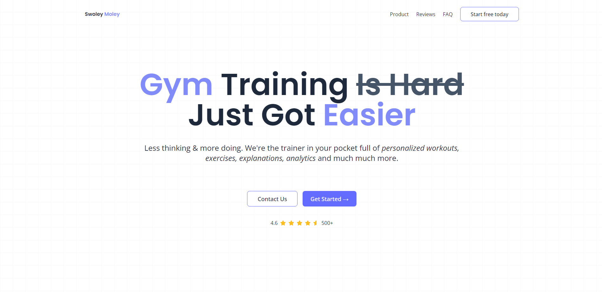

 

# Sveltekit Project from FreeCodeCamp

This is a tutorial project with SvelteKit from FreeCodeCamp. If you want to learn more, visit their [official website](https://www.freecodecamp.org/) or [youtube channel](https://www.youtube.com/@freecodecamp) for more information.

## Create your own project with these guides:

- [Svelte + Vite](https://github.com/kerbethecoder/svelte)
- [SvelteKit + Vite](https://github.com/kerbethecoder/svelte)

> [!NOTE]
>
> These are not official documentations, but my first-hand experience in building static sites and deploying to GitHub Pages. Feel free to correct me if there are some erros in each guide. ^^

---

🌎 [kerbethecoder](https://kerbethecoder.com/)  
📫 krby.cnts@gmail.com  
📌 July 25, 2024
